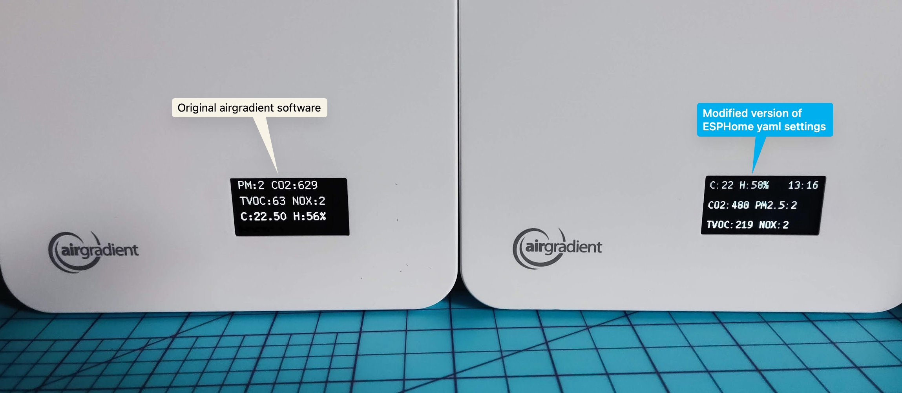

# airGradient-ESPHome

To be honest, I have no idea how ESPHome really works and what magic is behind this project. 

## What I did

I bought [The AirGradient DIY Air Quality Sensor (Pro Presoldered-Version, PCB Version 4.2)](https://www.airgradient.com/open-airgradient/instructions/diy-pro-presoldered-v42/).

Then I found [ESPHome-AirGradient
](https://github.com/ajfriesen/ESPHome-AirGradient) project that actually has a suitable yaml file [air-gradient-pro-presoldered.yaml](https://github.com/ajfriesen/ESPHome-AirGradient/blob/main/air-gradient-pro-presoldered.yaml)

It was working perfectly well in my installation. (BTW. Thank you, [Andrej Friesen](https://github.com/ajfriesen) for sharing it!)

But I bought additional VOC/NOx sensor - [SGP41 TVOC/NOx Module for DIY PRO Indoor Monitor](https://www.airgradient.com/shop/#!/SGP41-TVOC-NOx-Module-for-DIY-PRO-Indoor-Monitor/p/504083522/category=154292501) and wanted this information to be transferred to Home Assistant as well. 

I found that my sensor [SGP41 is already supported by esphome](https://esphome.io/components/sensor/sgp4x.html). So I only needed to copy this part into my file.

Then I played with fonts and found that UbuntuMono-R.ttf from [Ubuntu Mono](https://fonts.google.com/specimen/Ubuntu+Mono) looks OK.

Then I decided to update the screen with information about time and used [this page](https://esphome.io/components/time/#strftime) to update yaml definition. 

## Here is the result:

I like that I have all the information from sensors on the screen, time in the top right corner and have all the sensor data available for the Home Assistant.

Here is my yaml for Pro 4.2: [air-gradient-pro.yaml](air-gradient-pro.yaml)